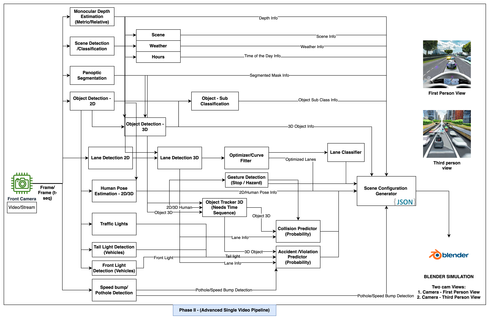

# Einstein-Vision
RBE 595 Project- Einstein Vision Implementation

### Base environment activation for simulation 

source ~/Projects/WPI/computer_vision/project3/blender-4.0.2-linux-x64/blender_env/bin/activate

### ToDO:

    []

### Architecture 

