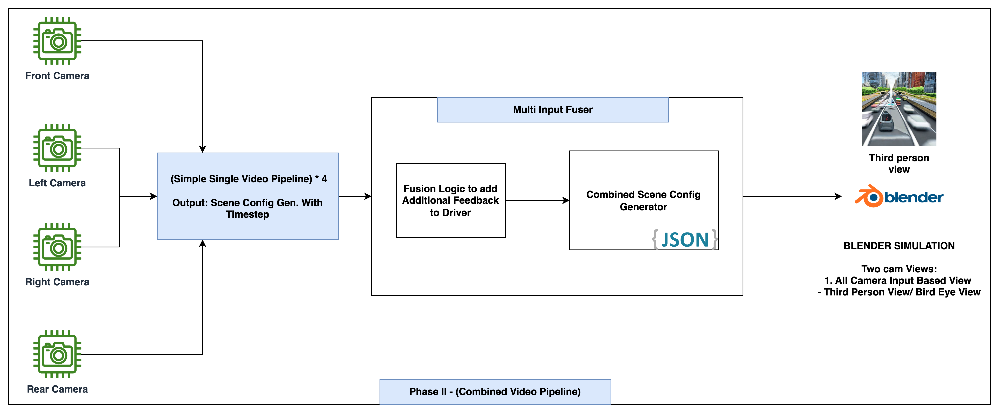

# Einstein-Vision
RBE 595 Project- Einstein Vision Implementation

### Base environment activation for simulation 

source ~/Projects/WPI/computer_vision/project3/blender-4.0.2-linux-x64/blender_env/bin/activate

### Notion page link for Full research - [Link](https://udaygirish.notion.site/Project-3-Visualization-f941159cac53424481ffd8e4834c9e98?pvs=74)

### ToDO :
(p-partial, x - completed, " " - not completed) \
implement/integration - reusable 

    [] Implement Lane Detection 3D (Not Required may be) - Already perfect with bezier curves
    [] Implement Scene Classification
    [x] Implement Object Detection - 2D 
    [x] Implement Object Detection - 3D
    [x] Implement Lane Detection 2D
    [p] Implement Lane Optimizer
    [x] Implement Human Pose Estimation 2D
    [p] Implement Human Pose Estimation 3D - PyMaf 
    [p] Implement Lane Classifier
    [p] Implement Traffic Light Detection - Classification
    [p] Implement Panoptic Segmentation 
    [] Implement Human Pose Classification /Gesture Recognition
    [p] Implement Depth Estimation - Monocular Metric/Relative
    [IP] Implement Vehicle Tail light Detection
    [IP] Implement Vehicle Front light Detection
    [p] Implement Vehicle Subclassification - yolo world
    [] Implement Object Tracker
    [] Implement Pothole Detection
    [p] Implement Speed Bump detection & Zebra crossing (Zebra Crossing not implemented)
    [x] Implement Vehicle State /Motion Estimator 
    [] Implement Collision Predictor
    [] Implement Accident/Violation predictor 
    [x] Implement OCR 
    [] Implement Arrow direction visualization

### Architecture 

    Each object Structure
    {
    '3d_world_coords': []
    'bbox_2d': []
    'class_name': ""
    'orientation': []
    'scale': []
    'score': 0.0
    'state_label': ""
    'avg_velocity': [],
    'track_id': 0,
    'pose_path': ""
}